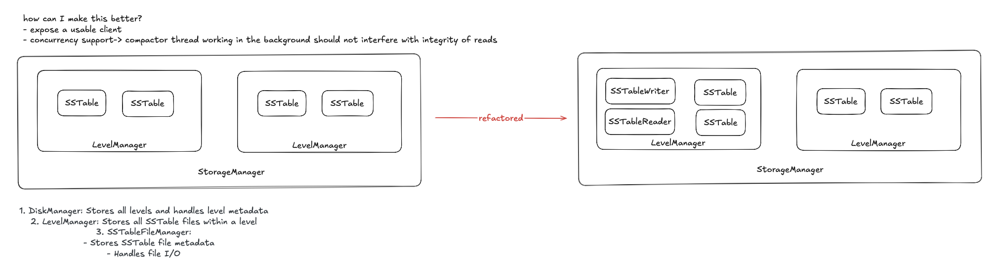

> SUMMARY:
> Identity = the object itself, including its address in memory.
> Value = the semantic value of the object, ie. its contents.

I'm currently refactoring TinyKV, particularly refining its architecture and defining clearer responsibilities between classes. I came across an interesting problem - how I would model and represent an SSTable.



I wrote an `SSTable` class. One instance represents a particular SSTable file on disk. A few things I did to enforce semantics for this class:
1. Made it non-copyable by deleting its copy constructor and copy assignment operator. This makes it such that we can't have 2 "instances" of the same SSTable.
## Storing SSTables inside a LevelManager
A `LevelManager` is responsible for managing the SSTable files on its level, for example:
1. Creating SSTables in this level.
2. Providing read-only access of SSTables in this level.
3. Allowing the deletion of selected SSTables in this level.

At first I thought to store the SSTables by value, like so:
```cpp
std::vector<SSTable> ssTables;
```
But I learned that this destroys the identity of an SSTable. For example, if the vector grows, previous SSTable pointers (`SSTable*`) get invalidated, even though some other thread may currently be reading from it! In that thread's perspective, the `SSTable*` it was given should have stayed valid, but for some reason it became invalidated while reading.

The alternative proposed:
```cpp
std::vector<std::unique_ptr<SSTable>> ssTables;
```

```cpp
class Test {
	public:
		Test() {
			std::cout << "default ctor called" << "\n";
		}
}
```
By storing unique pointers, the address of each SSTable remains stable even as the level grows, and vectors get resized.

## Identity vs location
Identity is **independent of where the object lives**. 
Identity is not the contents, it's the object itself.

If an SSTable moves from:
- Level 0 → Level 1
- vector index 3 → vector index 0

It must still be _the same SSTable_.

That’s identity.
### Pointer as identity
I had two methods I was unsure of what the API should be:

1. `LevelManager::getTables()`, and
2. `LevelManager::deleteTables()`

For `LevelManager::deleteTables()`, I wasn't sure what the type of the parameter was that we should pass in, which would allow the `LevelManager` to correctly identify the target SSTables. At first I was thinking to pass in some invariant, eg. `id`, but this would require a unique ID for each SSTable, which introduces ID management and additional complexity.

So I thought why not use the pointers themselves? If our invariant was that an SSTable object is identified by its identity - this means the object itself, including its location in memory, then this would be so much simpler.

Which gives us the final API:
1. `std::span<const SSTable* const> LevelManager::getTables() const;`
	We make the elements of the span `const` so that they cannot be moved, and they cannot be reassigned. Ie. we cannot do things like
	1. `s[0] = s[1]` -> cannot assign to a const object
	2. cannot use mutating algos (eg. `std::sort()`, `std::reverse()`, `std::swap()`), because they rely on assignment, but you cannot assign to a `const` object.
	
	Note that unlike spans, we can't make elements of a vector `const`, because STL containers require its elements to be movable/copyable and assignable. 
1. `Status LevelManager::deleteTables(std::span<const SSTable* const>)`